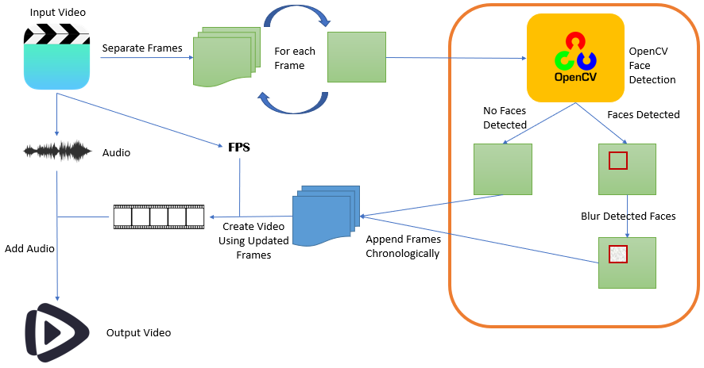

# Blurring Faces in Videos

An approach to blur faces in videos using Deep Learning.

## Table of Contents

1. [Introduction](#1-introduction)
2. [Setup](#2-setup)
3. [How to Run](#3-how-to-run)
4. [How Does It Work?](#4-how-does-it-work)
5. [Files & Folders](#5-files--folders)
6. [Dependencies](#6-dependencies)

## 1. Introduction

It is a common practice for faces of people to be blurred in videos to preserve privacy of individuals. There exists a plethora of software that can be used to blur human faces in a video file. This project is an attempt to blur faces using Deep Learning techniques.  

This project aims to:  

- Detect and blur faces that appear in videos with minimum manual effort.

- Let users to choose specific faces to be blurred using face recognition techniques [Work In Progress!!]

Below is a demonstration of how this project works. Left side is the input video (of Sebastian Vettel, from [Formula 1 Official Youtube Channel](https://www.youtube.com/c/F1)) and the right side is the output taken from the face blurring script.


## 2. Setup

The requirements have to be installed in order to run scripts on a local computer. It is recommended to create a Python virtual environment to run the scripts of this repository and to keep track of requirements.

First, clone this repository to the computer.

```
git clone https://github.com/theSLWayne/Video_Face_Blur.git
```

Then, create a Python virtual environment.

```
python -m venv facial_blur
```

Activate the created virtual environment.

- For linux:
    ```
    source facial_blur/bin/activate
    ```

- For Windows:
    ```
    facial_blur\Source\activate
    ```

Install dependencies to the virtual environment.

```
pip install -r requirements.txt
```

After everything is installed, all scripts of the repository can be run inside the virtual environment.

In order to deactivate the virtual environment, simply use `deactivate` command.

## 3. How to Run

`blur_faces.py` can be used to blur faces in a video. The syntax as belows:

```
python blur_faces.py --video_path path/to/the/video/file
        --output_directory folder/path/to/save/output/video
        --show_frames y
```

### Arguments

| Argument | Description | Notes |
|----------|-------------|-------|
| `--video_path` / `-p` | Path of the input video | Must be a valid path for a video file. |
| `--output_directory` / `-od` | Path of the folder where the output video should be saved to | **Not mandatory**. The video will be saved to `./outputs` folder when no output path is provided. |
| `--show_frames` / `-s` | Whether to display frames as they are processed | **Not Mandatory**. Defaulted to False. |

- If the provided output path does not exist, the output video will be saved to the default location (`./outputs`).

## 4. How does it work?

The workflow of face blurring can be broken down to a few key steps. Below is a higher level overview of the workflow.



- Audio, FPS (frames per second), and the list of frames are extracted from the input video.

- Each frame is sent through the OpenCV face detection model to identify faces.

- If there are faces identified, they are blurred using Gaussian Blurring and then the frame is appended to a separate frames list. If no faces were deteted in a frame, it is appended to the frames list without further processing.

- Updated frames list is converted into a video using the FPS count of the original video.

- Audio extracted from the original video is added to the video created using updated frames.

- Final video is written into the output directory.

## 5. Files & Folders

Description of files and folders included in the repository.

## 6. Dependencies

Main dependencies list

[↑ Top](#table-of-contents)